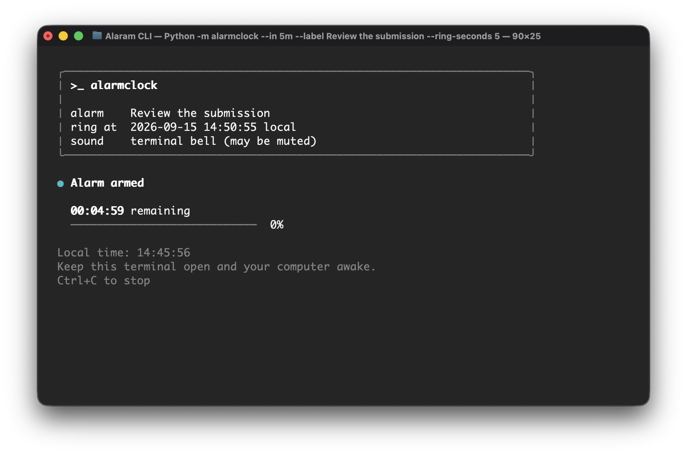

# Alarm Clock CLI

A small, dependency-free Python alarm clock. Set one alarm after a duration or at
a local time, see a live countdown, and receive a visible alert with a terminal bell.
The terminal interface uses a compact status panel, a live countdown, and a subtle
progress indicator, all rendered using Python's standard library.



## Run

Requires **Python 3.10+**. Run these commands from the repository root. No install,
API key, database, or third-party package is needed.

```sh
python3 -m alarmclock
```

Choose **1** for a duration, **2** for a local-time alarm, or **3** for a five-second
demo. Type a number and press Enter. Guided setup asks for a time, optional label,
sound preference, and alert length, then shows a summary before starting. Press
Enter to accept a displayed default. Mistakes are explained and can be corrected
at the same prompt; type `q` at any step to cancel. The quick demo starts immediately.

For a direct command, without prompts:

```sh
python3 -m alarmclock --in 5s --label "Stretch break" --ring-seconds 2
```

On Windows, use `py -3` instead of `python3` if needed.

Plain mode (`--plain`) looks like this:

```text
Alarm set in 5 seconds (about <local date and time> local): Stretch break
Keep this process running. Press Ctrl+C to cancel or stop the alert.
Sound uses the terminal bell; your terminal may mute it.
Time remaining: 00:00:05
ALARM! Stretch break
Alarm finished.
```

The dashboard adapts to smaller terminal windows and restores the original screen
and cursor when it exits. Use `--plain` for a simple one-line countdown. `NO_COLOR`,
`TERM=dumb`, redirected output, unsupported text encodings, and Windows consoles
outside Windows Terminal automatically use simple output. Redirected output
contains only the schedule and status messages, with no screen-control sequences.

## Usage

```sh
# Relative timer; units must be lowercase and in h, m, s order.
python3 -m alarmclock --in 1h30m --label "Take a break"

# The next 07:30 in the computer's local timezone.
python3 -m alarmclock --at 07:30 --label "Morning alarm"

# Seconds are optional for time-of-day alarms.
python3 -m alarmclock --at 14:45:10

# Visible alert without the terminal bell.
python3 -m alarmclock --in 3s --quiet --ring-seconds 1

python3 -m alarmclock --help
```

| Option | Behavior |
| --- | --- |
| `--in DURATION` | Integer hours/minutes/seconds, e.g. `30s`, `10m`, `1h30m5s`; 1 second through 7 days |
| `--at HH:MM[:SS]` | Local 24-hour time, with two digits per component |
| `--label TEXT` | Visible message, 1–80 printable characters; default `Alarm` |
| `--quiet` | Disable the bell; the visible alert and alert duration remain |
| `--plain` | Disable the dashboard and use simple terminal text |
| `--ring-seconds N` | Alert duration, 1–60 seconds; default 10 |

When using flags, exactly one of `--in` and `--at` is required. Guided setup opens
only when there are no arguments and both input and output are connected to a
terminal, so scripts never unexpectedly wait for input. If a time has already passed, or
equals the current time, the alarm is scheduled for tomorrow. Durations such as
`90m` are valid; negative, fractional, and unitless durations are rejected.

Press **Ctrl+C** while waiting or ringing to stop cleanly.

| Exit status | Meaning |
| --- | --- |
| `0` | Alarm completed, help displayed, or guided setup declined/quit |
| `2` | Invalid command-line arguments |
| `130` | Alarm or guided setup interrupted with Ctrl+C |

## Design

Requirements, decisions, and a planned 30-minute implementation sequence were
written down with AI assistance before coding: [design and plan](docs/DESIGN.md).

```text
alarmclock/
  __main__.py  Module entry point
  cli.py       Guided setup, arguments, clock selection, alert, cancellation
  core.py      Duration parsing, next local occurrence, wait loop
  display.py   Responsive ANSI terminal dashboard and terminal capability checks
tests/
  test_core.py         Parsing and timing with a fake clock
  test_cli.py          CLI behavior and clock selection
  test_integration.py  Actual processes, elapsed time, and POSIX SIGINT
  test_display.py      Plain fallback, small terminals, and screen/cursor cleanup
  test_setup.py        Guided choices, defaults, retries, confirmation, cancellation
```

- **Duration alarms use `time.monotonic()`.** Moving the system clock does not
  change how long a timer waits. The printed calendar time is an estimate.
- **Time-of-day alarms use `time.time()`.** The next local date/time is resolved
  to a timestamp at creation, then compared with the wall clock until due.
- **The wait loop sleeps for at most one second at a time.** It rechecks the
  deadline after every sleep, including early returns and clock adjustments.
  It is not a hard real-time scheduler; OS scheduling can delay an alert.
- **Clocks and sleep are injectable.** Tests can simulate hours and clock jumps
  immediately, without changing the computer's clock.
- **One foreground process keeps the lifecycle simple.** No threads, background
  worker, database, saved alarms, recurrence, or snooze in this scope.

## Tests

```sh
python3 -m unittest discover -v
```

The suite contains **39 tests**, including parameterized invalid-input cases.
It checks parsing, midnight/year rollover, exact-time behavior, fractional waits,
forward/backward clock changes, correct clock selection, bounded ringing, quiet
output, and cancellation. Integration tests launch the real CLI; one waits for a
one-second alarm and one-second alert. POSIX signal testing is skipped on Windows;
mocked cancellation tests still run there. Dashboard tests also check plain-output
preferences, compact layout, and restoring the cursor and screen after interruption.
Guided setup tests cover defaults, correcting invalid entries, demo selection,
declining confirmation, quit/EOF/Ctrl+C, and never prompting for redirected input.

GitHub Actions is configured for Python 3.10 and 3.14 on Linux, and Python 3.14
on macOS and Windows. See [validation notes](docs/VALIDATION.md) for local evidence
and [the workflow](.github/workflows/tests.yml) for the CI configuration.

## Limits and next steps

- Keep the process running and the computer awake. Closing the terminal ends the
  alarm. It cannot wake a sleeping computer or restore alarms after a restart.
  Whether a monotonic clock counts suspended time depends on the platform.
- Audible delivery depends on terminal settings. The CLI sends a bell character;
  it cannot guarantee a sound. The visible `ALARM!` message is always printed.
- The host timezone is used. Python/OS conversion decides ambiguous or nonexistent
  daylight-saving times; the resolved time and UTC offset are displayed. Changing
  timezone after scheduling does not change the stored deadline.
- An absolute alarm reacts to system-clock changes: a forward jump past the
  deadline fires on the next check; a backward jump can extend the wait.

With more time, first clarify whether reliable background delivery is required.
That would justify OS scheduling and a stronger notification mechanism. Recurrence,
snooze, and explicit DST policies should follow agreed requirements.

## AI assistance

Codex helped refine the requirements and generated code, tests, and documentation.
The design records the reasoning and scope; [the process notes](docs/AI_PROCESS.md)
summarize the work and review without representing a reconstruction as a live recording.
